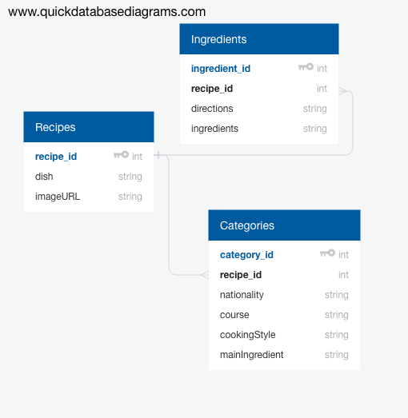

# CookBook
This app was made with javafx and Derby database program. The app's home page previews some recipes from the database. 
The app allows the user to directly add and remove recipes from the database. 
FileChooser object is used to allow user to select an image for the recipe.
There is also a table view of all the items in the database.
When a row is selected in the table view, the recipe ingredients and directions are listed.
The application uses an Observable array list to set all of the items in the table view.
The database contains categories such as recipe course, nationality, cooking style and main ingredient.

# GUI Principles
I adhered to the GUI principles by making all of application screens consistent in style.
There are some css styles added for hover functions to improve the aesthetic look.
I also tried to make the overall look simple and concise.
I tried to make all of the user functionalities clear and to the point, so the the overall user experience is positive.

# Database diagram:

